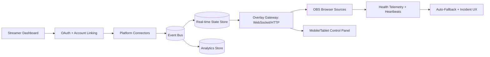
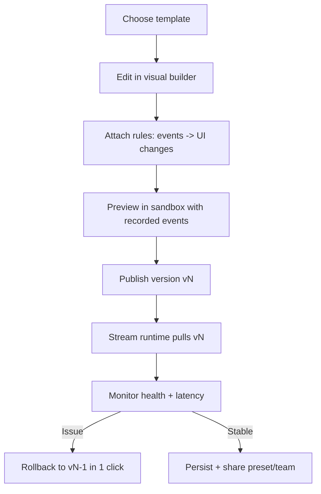
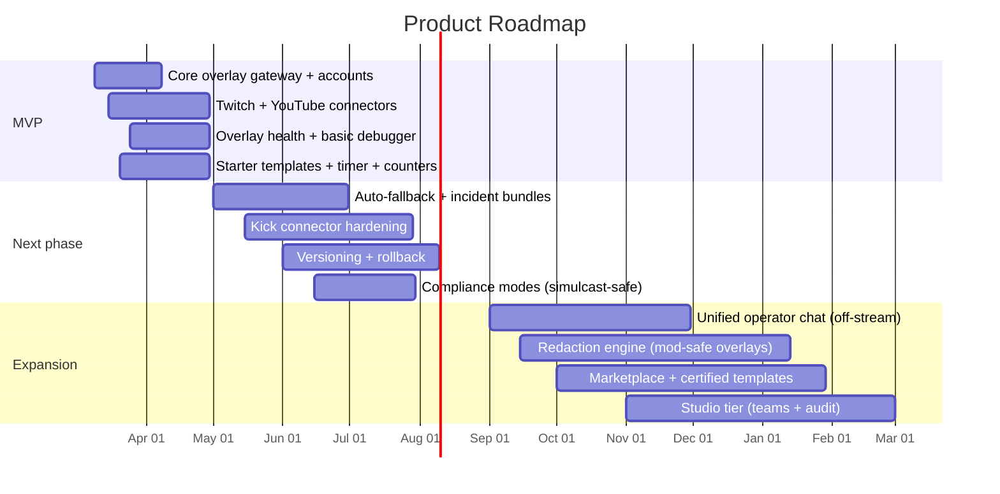

# Building a 100× Better Stream Overlay Platform Than Slipz

## Executive summary

Slipz positions itself as a free, lightweight set of stream overlays that run as an entity["organization","OBS Studio","open-source streaming software"] browser source (no downloads/plugins) and focuses on simple, high-signal data: viewer counts, follower counts, and (with login) subscriber counts, plus a timer utility. citeturn0search0turn0search1turn0search10turn6search0 Its core differentiator is “minimalism”: minimal data collection, minimal scopes, minimal UX friction. citeturn6search0

A “100× better” product should **not** compete on “more widgets.” The strongest evidence across streamer communities and support ecosystems is that creators are repeatedly burned by: (1) **reliability failures** (overlays not loading, freezing, desyncing, audio delays), (2) **hard-to-debug browser-source behavior** inside OBS, (3) **platform fragmentation** (fast-growing platform mix, plus uneven APIs), and (4) **compliance and moderation risks** when combining cross-platform activity on-screen. citeturn18reddit41turn18reddit45turn27reddit46turn28search3turn35reddit34turn37search2

The design implication is clear: the next generation product should be a **reliability-first, cross-platform event and overlay runtime**—with built-in observability, automatic fallbacks, a debuggable “event pipeline,” and compliant multi-platform display modes—rather than just a collection of URLs. This is the main strategic whitespace between “simple counters” and today’s dominant tools. The competitive set’s documentation and troubleshooting guides implicitly confirm the pain (they exist because breakage is common). citeturn19search4turn25search0turn28search2

Market context strengthens the case for a cross-platform core: industry reporting shows major audience/creator migration and diversification, including rapid growth for Kick and continued strength for YouTube live, which increases demand for unified tooling. citeturn24search0turn24search2 Meanwhile, Facebook Gaming-specific investment is likely declining ROI because Meta is winding down the Facebook Gaming Creator Program in 2026 (support ending October 31, 2025). citeturn16search1turn16search0

What follows is a rigorous blueprint: Slipz gap analysis, prioritized streamer needs, direct user feedback synthesis, an 8-product benchmark, and a concrete product plan (architecture, UX flows, integrations, and roadmap).

## Slipz feature and gap analysis

### What Slipz appears to offer today

Based on Slipz’s publicly accessible pages and snippets, the current feature set is best described as “fast utility overlays”:

- A set of **free stream overlays** for streamers that run via OBS browser source with no downloads/plugins. citeturn0search0  
- A **count up / count down timer** utility (counting up from a past date or down to a future date). citeturn0search1  
- **Real-time channel metrics overlays** (viewer counts, follower counts) and **subscriber counts** that require authenticated API access. citeturn6search0turn0search10  
- OAuth connections for Twitch, Kick, and Google/YouTube and a per-user **shared API key** embedded in overlay URLs to authorize OBS browser-source requests (because browser sources may not have the same session-cookie behavior as a normal browser session). citeturn6search0  
- A stated “minimal data” posture: store only what’s necessary to make overlays work; no email/password/payment storage; no tracking cookies beyond a functional session cookie. citeturn6search0  
- Implementation details disclosed in the privacy policy: tokens stored server-side; Redis on entity["company","Railway","hosting platform"]; sessions expire after 30 days. citeturn6search0

**Important limitation:** the About/Features pages appear partially JS-rendered in some contexts; analysis above relies on a combination of accessible snippets and the fully crawled privacy policy. This means there may be additional tools beyond what is visible here. citeturn0search0turn0search1turn6search0  

### Strengths

Slipz’s strengths are structural and worth preserving:

**Low-friction setup with OBS-native mental model.** “Browser source + URL” is the lingua franca of overlays, and Slipz aligns with it. citeturn0search0turn25search0turn34search4

**Privacy-forward, minimal-scopes posture.** Slipz explicitly requests read-only permissions and enumerates them (e.g., Twitch `channel:read:subscriptions`; YouTube `youtube.readonly`). citeturn6search0turn13search3 This reduces user fear and onboarding drop-off.

**No-account-needed for some overlays.** Timer/viewer/follower overlays work without login; only subscriber counts require sign-in. citeturn6search0 This is a clever growth lever: “try before trust.”

**Clear disclosure of storage and hosting approach.** Many tools do not explain how tokens are stored; Slipz states server-side token storage, data retention approaches, and deletion by disconnecting. citeturn6search0

### Weaknesses and gaps

Slipz’s key gaps map directly to demonstrated streamer pain and to competitor capabilities:

**Limited reliability and troubleshooting surface area.** The ecosystem shows frequent browser-source breakage (blank overlays, frozen chat, audio delays, intermittent outages). Users often resort to cache refreshes, toggling browser hardware acceleration, relinking accounts, or reinstalling—steps that are both common and nondeterministic. citeturn18reddit45turn27reddit45turn28search2turn19search4 Slipz does not (from visible materials) provide a first-class “overlay health” debugger, incident telemetry, or fallback mode.

**No visible event/automation layer.** Modern streamer workflows increasingly rely on event triggers (channel points, follows, subs, raids) driving scene/source changes, animations, and notifications—capabilities emphasized by automation tools. citeturn23search2turn23search5 Slipz appears primarily “display metrics,” not “react to events.”

**No visible multi-platform compliance modes.** Twitch’s Simulcast Guidelines prohibit using third-party services that combine activity from other platforms “on your Twitch stream” during simulcast (e.g., merged chat). citeturn37search2turn35reddit34 Streamers still want a unified operational view, but with compliant on-screen outputs.

**Narrow integrations beyond basic counts.** Competing platforms offer tipping, alerts, sponsorship workflows, and custom widget engines. citeturn21search2turn25search1turn34search0 Slipz currently reads as “utility overlays,” not a platform.

**No monetization loop.** Slipz’s minimal posture is great for adoption, but the absence of monetization primitives (marketplace, tipping, partner offers, paid tiers) makes sustainability harder than competitors that monetize via subscriptions, SaaS tiers, and sponsorship tools. citeturn20search0turn22search0turn21search6

## Streamer needs and voice of customer

### Cross-platform reality

The platform mix is increasingly fragmented. Live-stream trend reporting highlights strong growth for Kick and continued scale for YouTube live, which increases the need for cross-platform tooling rather than single-platform stacks. citeturn24search0turn24search2

At the same time, platform policies constrain what can be shown on-stream during simulcasting. Twitch’s Terms of Service includes Simulcast Guidelines that explicitly prohibit third-party services that combine other platforms’ activity on the Twitch stream during simulcast. citeturn37search2turn35reddit34 This turns “combined chat overlay” into a product design problem: creators want unified operations, but may need separated audience-facing surfaces.

Kick’s developer ecosystem has historically been uneven for third-party builders: public discussions describe missing/broken docs and reliance on unofficial APIs, and Kick’s own DevDocs issue tracker contains requests for desktop-friendly event delivery (e.g., WebSocket-based events rather than only webhooks). citeturn15reddit47turn33search2 This matters because overlays are latency-sensitive and often run from desktop streaming rigs.

Finally, Facebook Gaming-specific investment appears riskier: Meta is retiring the Facebook Gaming Creator Program in 2026 and ending dedicated partner support on October 31, 2025. citeturn16search1turn16search0 Streamers may still broadcast to Facebook, but a “Facebook-first” strategy is likely suboptimal versus platform-agnostic architecture.

### Prioritized needs by frequency and impact

Method: needs are ranked using a qualitative evidence score:  
- **Frequency** = how often the need appears across independent sources (Reddit threads, OBS forums, docs/troubleshooting pages, reviews).  
- **Impact** = likely effect on stream continuity, revenue, and creator stress when unmet.

| Need | Why it matters | Frequency | Impact | Representative evidence |
|---|---|---:|---:|---|
| Reliability of browser-source overlays (load, stay loaded, no freeze) | Broken overlays cause missed alerts, lost engagement, and stream interruption | Very high | Very high | Multiple reports of overlays not loading / going black / requiring cache refresh; outages affecting overlay providers; official troubleshooting content exists because it’s common citeturn18reddit41turn27reddit46turn28search3turn19search4turn19search0 |
| Fast debugging and observability (what broke, where, why) | Streamers need deterministic fixes, not folklore | High | Very high | Users cycle through long troubleshooting lists; support often redirects between vendors (OBS vs provider) citeturn18reddit45turn28search6turn28search0 |
| Multi-platform operational view (chat + events) with compliant on-screen modes | Creators multitask across platforms but face policy constraints | High | High | Repeated questions about combining chats across Twitch/YouTube/Kick; Twitch Simulcast Guidelines constrain combined activity on Twitch stream citeturn35reddit37turn35reddit38turn37search2 |
| Low-latency real-time event ingestion | Alerts and triggers lose value if delayed | Medium-high | High | Reports of delayed audio in alerts; desire for real-time gateways (websockets) citeturn18reddit49turn21search0turn33search2 |
| Simple onboarding (connect → generate overlay URL → works) | Setup friction kills adoption | High | Medium-high | Competitor docs focus heavily on “copy widget URL → add browser source” because setup is central citeturn25search0turn34search4turn6search0 |
| Safe, minimal scope permissions and transparent data practices | Trust barrier for OAuth tools | Medium | High | Slipz’s explicit minimal collection; Twitch warns apps not to request excess scopes citeturn6search0turn13search3 |
| Customization without “code traps” | Streamers want brand polish without fragile custom JS | Medium | Medium-high | Custom widget tools are powerful but have sandbox limits (no cookies/IndexedDB), which can surprise developers citeturn34search0turn34search1 |
| Monetization primitives built-in (tips, sponsors, merch signals) | Stream sustainability and pro workflows | Medium | High | Competitors emphasize tipping, sponsorships, and fees; users review them heavily citeturn21search2turn30search2turn29search0 |

### Direct feedback synthesis

Below are representative, direct user statements (kept short) that recur across communities:

- **Breakage in OBS:** creators report overlays “abruptly stopped loading in OBS” and even direct overlay URLs erroring. citeturn18reddit41  
- **Chat overlay failures:** creators describe chat overlays visible in provider dashboards but not showing in OBS. citeturn18reddit46turn27reddit48  
- **Streams harmed by missed alerts:** creators report alerts not displaying “for weeks” and switching tools as a workaround. citeturn18reddit45  
- **Browser-source instability mid-stream:** reports of browser sources “randomly go black mid-stream” affecting chat, overlays, and alert tools. citeturn27reddit46  
- **Multi-chat desire and tool shopping:** repeated questions on combining chats across Twitch/YouTube/Kick and complaints that free plans are limited or delayed. citeturn35reddit37turn35reddit37  
- **Compliance and moderation risk:** users warn that combined overlays may not remove moderated messages correctly and cite Twitch Simulcast Guidelines restrictions. citeturn35reddit34turn37search2  
- **Infrastructure dependency reality:** some overlay outages align with broader cloud incidents; Google’s June 12, 2025 incident report documents a multi-hour disruption window. citeturn19search0turn19news41  

Discord and X are harder to cite systematically because many communities are private or login-gated; however, Kick’s DevDocs explicitly routes “quick feedback” to Discord, and Reddit threads reference Discord as a key (and sometimes fragile) knowledge channel. citeturn33search1turn15reddit47

## Competitive landscape benchmark

The market splits into three buckets: (1) overlay/widget platforms, (2) multistream studios, and (3) automation/control planes. Slipz currently lives at the “utility overlay URLs” edge of (1). A 100× product should converge the best of all three—without inheriting the fragility.

image_group{"layout":"carousel","aspect_ratio":"16:9","query":["StreamElements overlay editor screenshot","Streamlabs Desktop streaming software interface","Restream Studio live streaming browser studio interface","Lightstream Studio overlay dashboard"],"num_per_query":1}

### Comparison table

| Product | Core value | Pricing and monetization | Integrations and platforms | UX and setup | Scalability and reliability signals |
|---|---|---|---|---|---|
| entity["organization","StreamElements","streaming tools platform"] | Free overlays, alerts, widgets; cloud overlay manager; developer docs and WebSocket gateway | Marketed as “100% FREE” for alerts/widgets; monetizes via tipping (SE.Pay), sponsorships, etc. citeturn21search1turn21search2turn30search2 | Twitch/YouTube focus for overlays; multi-account considerations in docs; real-time via Astro WebSocket gateway citeturn21search4turn21search0 | Mature overlay editor; supports custom widgets with HTML/CSS/JS but in sandbox (no cookies/IndexedDB), with SE_API store citeturn34search0turn34search4 | Public troubleshooting guides for overlay issues (resolution, hardware acceleration, etc.) indicate common failure modes; outages can occur citeturn19search4turn18reddit41 |
| entity["company","Streamlabs","streaming software and alerts"] | Widget URLs (alert box/chat box/etc.), desktop app suite, multistreaming | Ultra subscription is stated as $27/month or discounted annually; monetizes via subscriptions and add-ons citeturn20search4turn25search3 | Supports many streaming platforms (including Twitch/YouTube/Facebook/Kick per FAQ); offers widgets via browser source URLs citeturn20search4turn25search0 | Strong docs for “find widget URL → paste as browser source” citeturn25search0turn25search1 | Mixed reliability sentiment: recurring reports of alerts not showing or audio delays; user reviews include complaints about support and billing citeturn18reddit49turn28search2turn29search0 |
| entity["company","OWN3D Pro","streaming widgets subscription"] | Subscription bundle: overlays, widgets, assets; scene builder | Widget Pass ~€7/mo; Stream Pass ~€14/mo with larger libraries and storage; also one-time “Exclusive” purchases citeturn20search0turn20search7 | Marketed as multiplatform support; large widget/overlay library citeturn20search0 | Strong template-driven UX; scene builder preview and modular overlays citeturn20search8 | Reviews highlight support/billing complaints; suggests operational risk and churn drivers in subscription model citeturn30search1 |
| entity["company","Nerd or Die","stream overlay store"] | High-quality overlay “packages” and quick import; requires Streamlabs/StreamElements for live alert processing | Mostly one-time purchases (e.g., $15–$30 packages); monetizes through asset sales citeturn20search1turn20search3 | Works with OBS/Streamlabs/StreamElements via quick import and widget URLs citeturn34search2turn34search3 | Very fast install (“Super Charged” quick import); design/asset focused citeturn34search2 | Reliant on third-party alert/widget processing; reliability inherits underlying providers citeturn34search3 |
| entity["company","Restream","multistreaming service"] | Multistreaming, studio, cross-platform chat, analytics | Free tier; paid tiers scale by destinations and features (standard/pro/business) citeturn22search0turn22search4 | Multi-destination streaming, cross-platform chat, encoder integrations (works with OBS, etc.) citeturn22search4turn22search0 | Low onboarding friction; browser studio; teams/workspaces in higher tiers citeturn22search0 | Review profile suggests strong support reputation but some billing/practice complaints; still a dependency risk if used as core “chat overlay” citeturn30search0turn35reddit35 |
| entity["company","Lightstream Studio","cloud live streaming tool"] | Cloud-based production (esp. console) with overlays/alerts | Gamer/Creator plans by resolution; pricing documented by support and product pages citeturn22search1turn22search2 | Sends console streams to cloud and layers overlays before broadcast; browser-based workflows citeturn22search3turn22search2 | “No downloads” positioning; 7-day trial; simplified cloud pipeline citeturn22search2 | Cloud pipeline reduces local CPU; but adds vendor dependency and potential latency; pricing shifts with resolution caps citeturn22search1turn22search2 |
| entity["organization","Streamer.bot","stream automation software"] | Automation/control plane: triggers → actions; integrated multi-chat | Free core with extensive triggers/actions; creator states goal is to keep it free but costs exist citeturn23search6 | Integrates with OBS via OBS WebSocket (v4 & v5); supports Twitch/YouTube/Kick/Trovo chat; can dock in OBS citeturn23search0turn23search2 | Power-user UX; steep learning curve but very capable; internal WebSocket/HTTP servers for API control citeturn23search2turn23search5 | Community reports issues after OBS updates and action remapping needs; highlights fragility at integration boundaries citeturn23reddit45 |
| entity["organization","Mix It Up","stream bot software"] | Bot + overlays/widgets + engagement systems (currency, games, giveaways) | Marketed as free/open-source; monetizes via community support (e.g., Patreon) citeturn26search7turn26search2 | Twitch/YouTube/Trovo focus; Discord posting and broad feature surface (moderation, events, counters, overlays) citeturn23search4turn26search7 | Feature-rich UI; more “platform” than “URL tool” citeturn23search4 | Like other desktop-integrated tools, can be impacted by OBS/browser-source quirks; users report browser sources disappearing mid-stream in general citeturn27reddit47 |

**Benchmark conclusion:** Slipz can win by becoming the “reliability layer” and “event integrity layer” that none of these products fully guarantee—especially for OBS browser sources. The competitor set either (a) is feature-rich but fragile, (b) is asset-only, or (c) is a powerful automation plane without an opinionated, production-grade overlay runtime.

## Product improvements that are plausibly 100× better

### Product thesis

Build a **Stream Overlay Runtime and Control Plane**: an event-driven system that guarantees “what happens on stream” is reliable, debuggable, and compliant—across platforms and across the unpredictable realities of OBS browser sources.

This is a strategy of **operational excellence**, not just “more widgets.”

### Reference architecture and data model

Core architecture goals:
- **Deterministic rendering:** overlays should be reproducible from an event log + state snapshot.
- **Low latency:** event-to-overlay update typically <250ms for on-screen counters and <1s for alerts (subject to API constraints).
- **Observability:** every overlay instance reports health (heartbeat, frame clock, last event applied).
- **Safety and compliance:** configurable “Twitch simulcast-safe mode” informed by Twitch’s Simulcast Guidelines. citeturn37search2

Mermaid architecture flow:



Data architecture recommendation:
- **Event log** (append-only): normalized events (follow/sub/tip/chat/mod actions) with platform provenance.
- **State store** (fast): per-overlay computed state (counts, goals, timers).
- **Analytics store** (time-series): retention, alert latency, failure rates, overlay load times.

### Key user journeys

Onboarding and first overlay publish:

```mermaid
flowchart TD
  S[Sign in] --> L[Link one platform via OAuth]
  L --> P[Pick "Starter Overlay" template]
  P --> G[Generate OBS Browser Source URL]
  G --> O[Add Browser Source in OBS]
  O --> V[Verify: overlay heartbeat + test event]
  V -->|Pass| A[Activated: save preset + pin to scene]
  V -->|Fail| D[Guided Debugger: diagnose + auto-fix checklist]
  D --> V
```

Creating an event-driven overlay (alerts + counters) with rollback:



### Concrete innovations with specs and complexity

The list below is intentionally implementation-oriented (what to build, how it works, and what it depends on). Complexity is estimated for a small product team (roughly: Low = days, Medium = 2–6 weeks, High = 2–4+ months).

| Innovation | What it does | Required integrations | Data/tech spec | Dev complexity |
|---|---|---|---|---|
| Overlay Health Protocol | Every overlay instance emits heartbeat + “last event applied” so creators know what’s stale | OBS browser sources; your gateway | Heartbeat every 2–5s; overlay “health badge” UI; server stores last-seen + client version | Medium |
| Auto-fallback Mode | If real-time fails, show “degraded mode” UI (cached counts + timestamps) | Your state store | Serve cached values with “as-of” timestamp; retry w/ exponential backoff; failsafe styling | Medium |
| Event Integrity Dashboard | Shows event pipeline end-to-end (received → processed → rendered) | Twitch EventSub subscription types; YouTube APIs; Kick webhooks | Per-event trace IDs; latency histograms; replayable event log | High citeturn13search0turn13search1turn14search2turn33search2 |
| Compliant Simulcast Modes | “Twitch-safe overlay mode” that avoids forbidden combined activity | Twitch Simulcast Guidelines | Policy engine toggles: do not display merged non-Twitch chat; separate boxes; watermark labels | Medium citeturn37search2 |
| Unified Cross-Platform Counters | One overlay that can display per-platform and total counts where allowed | Twitch APIs/scopes; YouTube `concurrentViewers`; Kick APIs | Normalized “metric schema”; platform provenance; handle missing/hidden YouTube counts | High citeturn6search0turn14search2turn15search1 |
| Live “Debugger Overlay” | A hidden overlay layer that can be toggled on-stream to show diagnostics | OBS hotkey/scene; your control panel | Renders last API call time, last error code, cached vs live | Medium |
| Local Companion Agent | Optional local app that can bridge local signals (game stats, scene state) and reduce cloud dependency | OBS WebSocket; local system APIs | Runs on streamer PC; signs events; can serve local assets to overlay runtime | High citeturn23search2 |
| Asset Hosting Without “Sandbox Traps” | Enable richer custom overlays without the constraints seen in some custom widget sandboxes | Your overlay runtime | Provide secure KV store with delete + TTL; allow IndexedDB in isolated origin; CSP policy | High citeturn34search0 |
| Deterministic “Overlay as Code” | Versionable overlay definitions for teams and pros | GitHub export optional | Overlay JSON manifest + schema; CI-style validation; version pinning | Medium-high |
| Multi-platform Chat for Operator Only | Unified chat console for the streamer (not necessarily shown on Twitch output) | YouTube LiveChatMessages; Twitch chat; Kick chat | Multi-room chat router; moderation actions; redact logic | High citeturn14search0turn23search0turn33search8 |
| Moderation-safe Redaction Engine | Ensures deleted messages disappear everywhere (fixes “overlay still shows deleted msg” issue) | Platform chat APIs | Message lifecycle IDs; tombstone events; overlay render invalidation | High citeturn35reddit34turn14search0 |
| “One-click incident pack” | Generates a shareable debug bundle for support | OBS logs import optional | Bundle: overlay IDs, timestamps, last 200 events, client traces, config hashes | Medium |
| Creator Revenue Surfaces | Optional tipping/sponsor counters without replacing existing providers | Partner APIs (optional); webhook ingestion | Integrate via webhooks; don’t custody funds initially | Medium-high citeturn21search2turn21search5 |
| Template Marketplace With SLAs | Paid marketplace for “pro-grade” overlays with uptime/latency guarantees | None required | Certified templates; runtime-level SLO enforcement; refunds via credits | Medium-high |

**Why this is “100×”:** it targets the most painful failures (breakage + debugging + compliance) that repeatedly derail creators, rather than being “yet another overlay editor.”

## Business model, pricing, and go-to-market

### Business model recommendations

A sustainable model should preserve Slipz’s “try-without-trusting” adoption loop while layering monetization where pros feel pain.

**Freemium with reliability as the paid lever**
- Free: core counters, timer overlays, basic templates, limited refresh rate, community support.
- Pro: overlay health telemetry, auto-fallback, advanced customization, higher refresh, premium templates.
- Studio: team workspaces, versioning/rollback, audit logs, priority support, and higher API quotas.

This aligns with how adjacent categories monetize:
- Subscription tiers scaling by destinations/features (multistream services). citeturn22search0turn22search4  
- Subscription passes for widget libraries and assets. citeturn20search0  

**Marketplace take rate**
Sell pro templates and “event packs” (alerts, goals, branded widgets) with a revenue share. This mirrors the asset economy of overlay stores, but with runtime guarantees. citeturn20search1turn34search2

**Avoid custodial payments at first**
Competitors that handle money attract heavy trust, fraud, chargeback, and support burdens. Early-stage, integrate as “revenue surfaces” (display + alerts) before becoming a payment processor. citeturn21search2turn21search8

### Pricing tier sketch

- Free: $0  
- Pro: $9–$15/mo (solo creator)  
- Studio: $29–$59/mo (teams, pros, agencies)  
- Enterprise: negotiated (esports orgs, large events)

The specific price point should be validated against willingness-to-pay from “pain moments” (missed alerts, broken overlays, compliance warnings), which show up frequently in reviews and forums for competing tools. citeturn29search0turn28search2

### Go-to-market strategy

**Positioning:** “The overlay runtime that doesn’t break.”

**Beachhead segments**
- Multi-platform streamers (Twitch + YouTube/Kick) who need compliant operational tooling. citeturn35reddit37turn37search2  
- Pros and semi-pros whose streams are monetized enough that overlay failure is costly. citeturn21search6turn30search0  

**Channels**
- OBS-centric creator education: tutorials that replace folklore (“refresh cache”) with deterministic diagnostics. citeturn27reddit45turn28search2  
- Partnerships with automation communities (Streamer.bot and similar) by offering a stable overlay runtime they can target. citeturn23search2turn23reddit45  
- Template designers who want a better runtime than existing sandboxes (e.g., limitations like no cookies/IndexedDB in some widget environments). citeturn34search0  

## Roadmap, resourcing, and KPIs

### Roadmap milestones

Focus sequencing: **reliability → observability → extensibility → monetization**.



### Resource estimate

A realistic build plan (budget unspecified) that can ship MVP and then scale:

- 2 backend engineers (connectors, event bus, state store, gateway)
- 1 frontend engineer (dashboard, builder, debugger UX)
- 1 infra engineer (observability, deployment, SLOs)
- 1 product designer (overlay UX, templates, onboarding)
- 0.5 PM (or founder-PM)
- Optional: 1 developer advocate/support engineer (community + docs)

This staffing is justified by the complexity of maintaining multiple platform integrations (different auth schemes, event delivery models, and rate limits) and by the real-world fragility of overlay pipelines. citeturn13search1turn14search2turn33search2turn19search4

### KPIs tied to streamer outcomes

**Activation and retention**
- Activation: % of new users who (1) link a platform, (2) create an overlay, and (3) verify heartbeat in OBS within 30 minutes.
- Week-4 retention: % still streaming with at least one active overlay instance.

**Reliability and performance**
- Overlay availability SLO (e.g., 99.9% for Pro/Studio) with client-side telemetry.
- Median “event-to-render” latency for core counters.
- % sessions requiring manual cache refresh or re-auth (goal: drive down vs ecosystem norm). citeturn27reddit45turn19search4

**Support load**
- Mean time to resolution for overlay incidents (target large reductions via incident bundles + debugger).
- % issues resolved without human support.

**Revenue**
- Free → Pro conversion driven by “health/debugger” and “fallback” features.
- Marketplace GMV and designer retention.

**Platform risk monitoring**
- Track policy-sensitive features (e.g., combined activity on Twitch stream) as first-class toggles with audit logging, because Simulcast Guidelines explicitly constrain the on-stream experience. citeturn37search2turn35reddit34